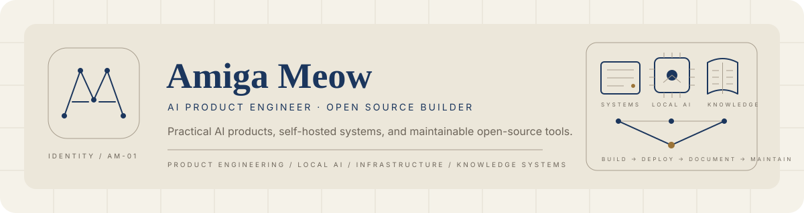

  

## 简介

我是一名独立开发者，主要构建 **AI 产品、自托管系统和可持续维护的开源工具**。

我关注的不只是模型或功能本身，而是完整交付链路：从模型接入、产品界面和部署方式，到文档、运维与真实使用边界。

<table>
<tr>
<td width="33%" valign="top">

### AI 产品工程

模型 API、工具调用、用户界面与可落地的工作流。

</td>
<td width="33%" valign="top">

### 自托管与基础设施

Docker、Linux、本地推理、部署路径与运行维护。

</td>
<td width="33%" valign="top">

### 知识与阅读系统

检索、引用、内容审核与可信的阅读体验。

</td>
</tr>
</table>

## 代表项目

<a href="https://github.com/AmigaMeow/puppy-stardew-server">
  <picture>
    <source media="(prefers-color-scheme: dark)" srcset="https://github-readme-stats.vercel.app/api/pin/?username=AmigaMeow&repo=puppy-stardew-server&theme=github_dark&hide_border=true&description_lines_count=2">
    
  </picture>
</a>
<a href="https://github.com/AmigaMeow/guanzizai">
  <picture>
    <source media="(prefers-color-scheme: dark)" srcset="https://github-readme-stats.vercel.app/api/pin/?username=AmigaMeow&repo=guanzizai&theme=github_dark&hide_border=true&description_lines_count=2">
    
  </picture>
</a>

<a href="https://github.com/AmigaMeow/kimi-k3-local">
  <picture>
    <source media="(prefers-color-scheme: dark)" srcset="https://github-readme-stats.vercel.app/api/pin/?username=AmigaMeow&repo=kimi-k3-local&theme=github_dark&hide_border=true&description_lines_count=2">
    
  </picture>
</a>

### 作品矩阵

| 项目 | 解决的问题 | 交付形态 | 核心方向 |
|---|---|---|---|
| [Puppy Stardew Server](https://github.com/AmigaMeow/puppy-stardew-server) | 让多人游戏主机能够长期、可重复部署 | Docker 服务、Web 管理、存档与备份 | 自托管、运维、产品化 |
| [观自在 Guanzizai](https://github.com/AmigaMeow/guanzizai) | 为古籍与公共领域文本提供可靠的数字阅读工具 | 阅读器、检索、书房、引用式问答 | Next.js、知识系统、内容治理 |
| [Kimi K3 Local](https://github.com/AmigaMeow/kimi-k3-local) | 降低大型开源模型本地部署与下载门槛 | 镜像直链、量化说明、硬件与运行指南 | Local AI、GGUF、llama.cpp |

## 技术栈

  <picture>
    <source media="(prefers-color-scheme: dark)" srcset="https://skillicons.dev/icons?i=ts,nextjs,react,nodejs,postgres,docker,linux,git,github,vercel,cloudflare&theme=dark&perline=11">
    
  </picture>

## GitHub 数据

  <picture>
    <source media="(prefers-color-scheme: dark)" srcset="https://github-readme-stats.vercel.app/api?username=AmigaMeow&show_icons=true&include_all_commits=true&hide_border=true&theme=github_dark&rank_icon=percentile">
    
  </picture>
  <picture>
    <source media="(prefers-color-scheme: dark)" srcset="https://github-readme-stats.vercel.app/api/top-langs/?username=AmigaMeow&layout=compact&langs_count=8&hide_border=true&theme=github_dark">
    
  </picture>

  <picture>
    <source media="(prefers-color-scheme: dark)" srcset="https://github-readme-activity-graph.vercel.app/graph?username=AmigaMeow&theme=github-compact&hide_border=true&area=true&custom_title=Public%20Contribution%20Activity">
    
  </picture>

数据卡主要基于公开仓库生成；私有项目、未公开代码与部分协作记录不会完整计入。

## 工程原则

- **先解决真实问题**：不为展示而堆功能，优先完成可使用的闭环。
- **部署也是产品的一部分**：安装、配置、升级和故障恢复都应被认真设计。
- **公开真实边界**：明确项目适用范围、已知限制与维护状态。
- **文档降低试错成本**：让用户能够理解、复现并继续维护项目。

---

  
   
  Build useful things · Deploy them clearly · Keep them maintainable

